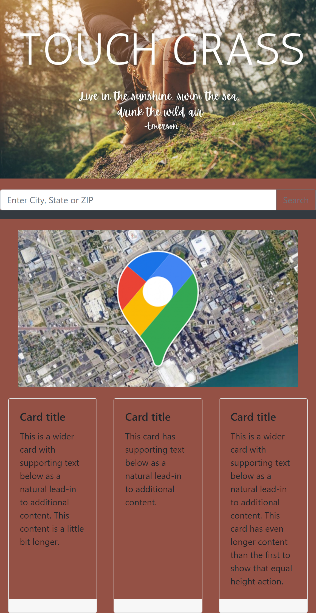

# touch-grass-app
Georgia Tech Full-Stack Developers students were assigned a collaborative project to produce an aplication/website 
that could solve a solve a real-world problem.

This project introduced 4 students to the barriers and challenages that collaborative work brings. Github was main tool 
used to share and push new changes to the website. This was also the first time the student used a minimum of two third party API's
in any assignment. 
     

Group project members were: Paulo Condori Pinedo, Ashley Thompson, Vincent Yang, Jules Franklin

Project time frame: 3 days July 5 9 a.m. - July 8 12 a.m. (Code Freeze)

## July 5 -------------

Group members proposed ideas for the project. The intial main ideas for the project were:
    - Providing location and information for people interested in hiking
    - Providng location and information for people interested in going to rivers
    - Providing location and information for people interested in going to parks in Georgia

Final Decision on proposed ideas:

    - The ideas for hiking and rivers were deemed too specific to finish in the limited time frame.
    The reason why it was deemed as such was because team members search through the web to look for 
    free and accessable API to use but unfortunately the API's that were found required extensive work to 
    fetch and pull that specific data. Some API looked at:
        - https://www.esri.com/arcgis-blog/products/national-government/national-government/n[…]-rivers-project-a-recreational-rivers-geospatial-map-database/
        - https://rapidapi.com/search/outdoor

    - The final(tentative) decision was to pursue the Parks in Georgia idea due to the fact there were a decent amount of 
    API's that we could use to fetch and pull the information we wanted. 

## Brief Summary of the Work done after the decision was made:

The group was split into two groups. One focused on the UX/UI design and another on the API fetch code. 

API -

    Group looked through API's and ran into issues. Issues with accessablility were that they werent open sources 
    with good documentation. 
    - https://www.nps.gov/subjects/developer/api-documentation.htm
    - https://prescriptiontrails.org/api/
    - https://www.trailforks.com/about/api/#!/trails/getTrails_get_0

    They worked on it for a couple of hours before they reached the conclusion that a change of the project goal would
    be beneficial to the group the issues were too much to solve in the allowed time frame for the project. 
    The group as a whole discussed possible ideas to move forward, the ideas had to be something that similiar the UX 
    design was made with idea of user knowing it was a website focused on outdoors activities. 

    We decided to now pursue a website that show national parks in the state they search.

UX/UI  -

    The first draft of the of the HTMl/CSS skeleton was produced. We used BootStrap for our HTMl skeleton. Most of 
    of customization was complete but we left certain 
's to hold the Google maps API info, fetch results from User input, information pull
    from weather API's.

## SUMMARY OF DAY 1:

    UX design first draft was complete.
    Group changed scope to National Park. 
    We now focused on making a website that would show the parks in the State they searched for.
    Another goal was to use Google Maps API on our website. How we were gonna use and implemment it 
    was still in queston but our main focuse on the first API the user would interact with.

 

## July 6 - 

    API - 

    Decide on MPS API 
    Primary goal was to access the information we need to show on our HTML. All code was writen on 
    separate branches before modifying any the main branch. Much time was spent on resolving the 
    reason by some request were blocked. After the focus was finding a way to sort Data.

    UX-UI -

    Created Hero image on canvas and made it mobile responsive. 

    ## SUMMARY OF DAY 2:
    
    Most of the focus was working to find a way sort the data from 
    the fetch.

## July 7 - 
    API -
    Fixed Google Maps issue 

    UX-UI-

    Slight changes on CCS as it caused issues with display fetch return data. The primary example was with the use 
    of " * " in CSS. If you aplied a background-color in CSS in the " * " section, it would cover the data display on 
    your webpage.

## Conclusion:

    The following images demonstrate the app's functionality:  
      
    
    

## Deployed Application
https://ashley1thompson.github.io/touch-grass-app-national-park-finder/

## Github Repo Link
https://github.com/Ashley1Thompson/touch-grass-app-national-park-finder